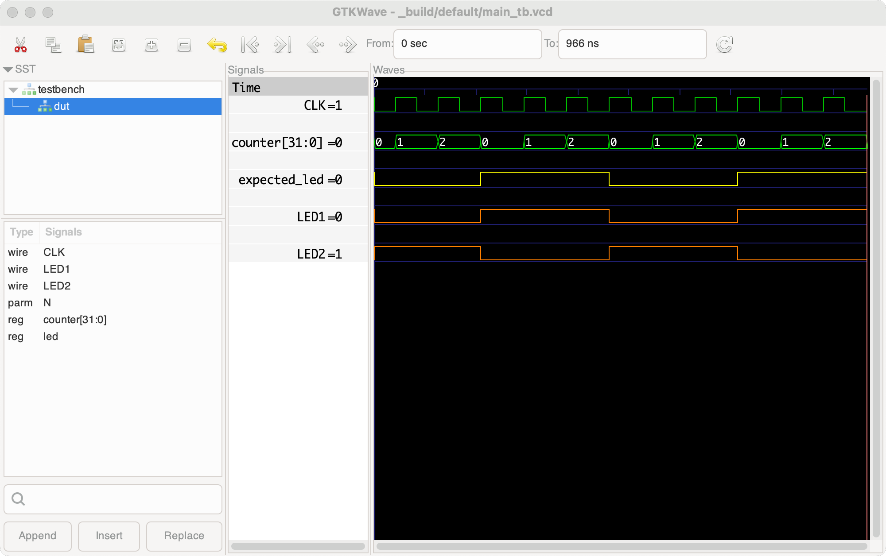

<!--
This README page is optimized for its appearance in the github repo rather than for the PyPi listing.
-->

<!-- Page banner -->

<!-- Attributes badges -->

<!-- Platforms badges -->
&nbsp;&nbsp;&nbsp;&nbsp;&nbsp;&nbsp;&nbsp;&nbsp;&nbsp;

<!-- Status badges -->

---

Apio CLI is an easy to install and use command-line tool for FPGA design from A to Z. For a quick start, visit the [Getting started with Apio](https://fpgawars.github.io/apio/docs/quick-start) guide.

 

Simulation example:

## Description

Apio CLI is a powerful yet easy-to-use command line tool for FPGA development using Verilog and System Verilog. It’s simple to install, no toolchains, licenses, or makefiles required, and works across Linux, Windows, and macOS. Apio CLI is 100% open source, and free to use.

Apio CLI supports every stage of the FPGA workflow, from simulating and testing, to building and programming the FPGA, using simple commands such as `apio test`, `apio build`, and `apio upload` that do what you expect them to do.

Apio CLI currently supports over 80 FPGA boards, custom boards can be easily added, and it includes over 60 ready-to-use example projects. Apio CLI currently supports the ICE40, ECP5, and GOWIN FPGA architectures.

## Sample Apio CLI session

1. `apio examples fetch alhambra-ii/getting-started` - fetch an example.
2. `apio build` - build the project.
3. `apio report` - report utilization and max clock speed.
4. `apio sim` - simulate the design and show signals.
5. `apio upload` - program the FPGA board.

## Apio CLI in the media

[Shawn Hymel's](https://shawnhymel.com/) excellent series on FPGA programming is based on and older version of **Apio CLI** and the the Icestick board

As the user **gh02t** said in this post on [Hacker-news](https://news.ycombinator.com/item?id=17912510):

> Apio is a command-line tool that automates installing the toolchain for your FPGA and running it. It just simplifies things, you don't have to use it if you'd rather call the individual tools for synthesis, P&R, simulation etc. It'd be reasonable to think of it as akin to a very smart Makefile combined with an automatic package manager, specialized to FPGAs (it's based on PlatformIO). It's nice when you're still kind of getting oriented, because you don't need to know how to set up and invoke the different tools... just call `apio build` or `apio sim`

## Resources

- [Apio CLI Documentation](https://fpgawars.github.io/apio/docs/)
- [Getting started with Apio](https://fpgawars.github.io/apio/docs/quick-start)
- [Apio CLI github repository](https://github.com/fpgawars/apio)
- [Apio CLI package on PyPi](https://pypi.org/project/apio/)
- [Apio CLI development environment](https://fpgawars.github.io/apio/docs/development-environment/) (for Apio CLI developers).
- [Apio CLI daily build](https://github.com/fpgawars/apio/releases)
- [Apio CLI Test Coverage Report](https://fpgawars.github.io/apio/coverage/)

## Credits

- Apio CLI was inspired by [PlatformIO](https://github.com/platformio/platformio) and was originally created by [Jesús Arroyo Torrens](https://github.com/Jesus89) in February 2016.
- Thanks to all the Apio CLI [contributors](https://github.com/FPGAwars/apio/graphs/contributors) over the years.
- Apio CLI uses open source tools including [Yosys](https://www.yosyshq.com), [Click](https://pypi.org/project/click), [Scons](https://pypi.org/project/SCons), [GTKWave](https://gtkwave.sourceforge.net), and [Python](https://www.python.org/downloads).
- [BQ](https://www.bq.com) sponsored this project from 02/2016 to 11/2016. Thanks.

## License

The Apio project itself is licensed under the GNU General Public License version 3.0 (GPL-3.0).
Pre-built packages may include third-party tools and components, which are subject to their
respective license terms.
