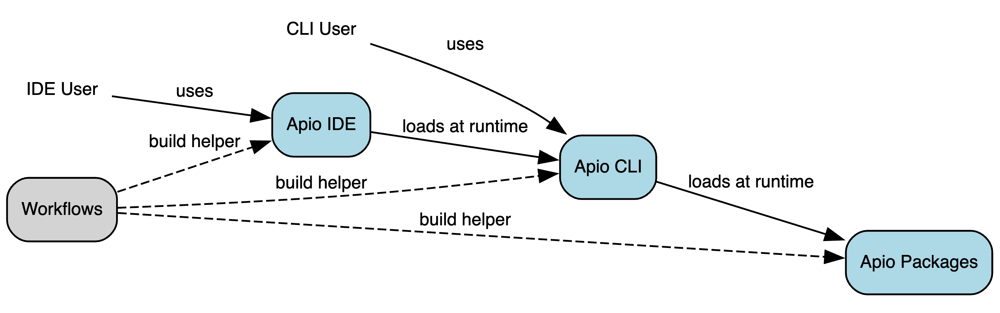

# Apio Repositories

Apio uses GitHub repositories under the `FPGAwars` organization for its source code, documentation, daily builds, and runtime packages.

**Apio applications**

| Repository                                                      | Application | Comments          |
| :-------------------------------------------------------------- | :---------- | :---------------- |
| [fpgawars/apio](https://github.com/fpgawars/apio)               | Apio CLI    | Command line tool |
| [fpgawars/apio-vscode](https://github.com/fpgawars/apio-vscode) | Apio IDE    | Vs Code extension |

**Apio packages**

| Repository                                                                      | Package name    | Comments     |
| :------------------------------------------------------------------------------ | :-------------- | :----------- |
| [fpgawars/apio-definitions](https://github.com/fpgawars/apio-definitions)       | `definitions`   |              |
| [fpgawars/tools-drivers](https://github.com/fpgawars/tools-drivers)             | `drivers`       | Windows only |
| [fpgawars/apio-examples](https://github.com/fpgawars/apio-examples)             | `examples`      |              |
| [fpgawars/tools-graphviz](https://github.com/fpgawars/tools-graphviz)           | `graphviz`      | Windows only |
| [fpgawars/tools-oss-cad-suite](https://github.com/fpgawars/tools-oss-cad-suite) | `oss-cad-suite` |              |
| [fpgawars/tools-verible](https://github.com/fpgawars/tools-verible)             | `verible`       |              |

**Utilities**

| Repository                                                            | Description                                           |
| :-------------------------------------------------------------------- | :---------------------------------------------------- |
| [fpgawars/apio-workflows](https://github.com/fpgawars/apio-workflows) | Provides common functionalities for Apio's workflows. |

For easier tracking and maintenance, all bug reports and discussions are consolidated in the main Apio repository: [fpgawars/apio](https://github.com/fpgawars/apio), which also serves as the project’s homepage.

## Repositories dependencies

<!--
Apio Repositories Relationship Graph (Graphviz DOT). Rendered manually
to assets/repos-diagram.png file using https://www.tools-online.app/tools/graphviz
and then cropped manually at the top and bottom.

digraph ApioRepositories {
    rankdir=LR
    fontname="Helvetica"
    fontsize=12

    node [fontname="Helvetica" fontsize=10 shape=rect style="rounded,filled"]
    edge [fontname="Helvetica" fontsize=10]

    "CLI User" [shape=none fillcolor=none style=""]
    "IDE User" [shape=none fillcolor=none style=""]
    "Apio CLI" [fillcolor=lightblue]
    "Apio IDE" [fillcolor=lightblue]
    "Apio Packages" [fillcolor=lightblue]
    Workflows [fillcolor=lightgray]

    "IDE User" -> "Apio IDE" [label="uses"]
    "CLI User" -> "Apio CLI" [label="uses"]
    "Apio IDE" -> "Apio CLI" [label="loads at runtime"]
    "Apio CLI" -> "Apio Packages" [label="loads at runtime"]

    Workflows -> "Apio IDE" [label="build helper" style=dashed]
    Workflows -> "Apio CLI" [label="build helper" style=dashed]
    Workflows -> "Apio Packages" [label="build helper" style=dashed]
}

-->

The following diagram shows the dependencies between the repos. At build time, the
apio-workflows repos provides common actions to the build workflows in the
the other repos. At runtime, the Apio IDE app loads the Apio CLI app, which loads the individual
Apio packages that are used on that platform.

## Repository branches

Apio repositories use the branch `main` as the main branch. Avoid other names such as `master`, and `develop`.

## Daily build workflows

The Apio repositories contain build workflows, typically at `.github/workflows/build-and-release.yaml` which builds the content of the repo and publish it as a temporary **pre-release** that is deleted after a few days.

- To make a release permanent, edit it in the Github dashboard and turn off the **Set as a pre-release** checkbox.

- To make an permanent release the official latest release, edit it in the Github dashboard and check the **Set as the latest release** checkbox.

Note that making a release permanent latest doesn't necessary make it used, and in most cases it needs to be 'published' as outlined in the table

| Build type                                          | Publishing                                                                                                                                                                |
| --------------------------------------------------- | ------------------------------------------------------------------------------------------------------------------------------------------------------------------------- |
| Apio packages such as 'examples' or 'oss-cad-suite' | • Update the packages versions in the relevant [apio remote config files](https://github.com/fpgawars/apio/tree/main/remote-config) for the new packages to be picked up. |
| Apio CLI                                            | • Publish in the various 'markets' such as PyPi.                                                                                                                          |
| Apio IDE                                            | • Publish in the VS Code market.                                                                                                                                          |

# Guidelines for daily build workflows

1. Each repo should build it's own stuff.
2. The build workflow should not be triggered by a push but only daily on cron, and manually from the github dashboard.
3. An automatic daily build should create a new **pre-release** with name and tag `yyyy-mm-dd` (based on current UTC time).
4. The daily build should run on cron at midnight UTC (`cron: "0 0 * * *"`) to reduce the chance of overwriting a manual build with same date.
5. Only a few N pre-releases should be kept (use automatic cleanup in the build daily workflow).
6. If the build workflow deals with binaries (e.g. verible or oss-cad-suite packages), it should run virus scan (e.g. ClamAV).
7. The builds should be from the latest commit of the repo (down the road we can add manual sha overrides).
