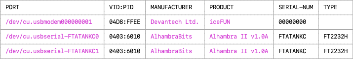

# Apio devices

---

## apio devices

The `apio devices` command group lists devices connected to your computer.
It is mainly used for diagnosing connectivity or driver issues.

<h3>Options</h3>

```
-h, --help  Show this message and exit.
```

<h3>Subcommands</h3>

```
apio devices usb
apio devices serial
```

---

## apio devices usb

The command `apio devices usb` displays the USB devices currently
connected to your computer. It is useful for diagnosing FPGA board
connectivity issues.

<h3>Examples</h3>

```
apio devices usb    # List USB devices.
```

<h3>Options</h3>

```
-h, --help  Show this message and exit.
```

Example output


---

## apio devices serial

The command `apio devices serial` displays the serial devices
currently connected to your computer. It is useful for diagnosing FPGA
board connectivity issues.

<h3>Examples</h3>

```
apio devices serial    # List serial devices.
```

<h3>Options</h3>

```
-h, --help  Show this message and exit.
```

<h3>Notes</h3>

- Devices like the FTDI FT2232 with multiple channels may appear as
  multiple entries—one per serial port.

- On Windows, manufacturer and product strings of FTDI based devices may
  show their FTDI generic values rather than the custom values such as 'Alhambra II' set by the device manufacturer.

Example output


