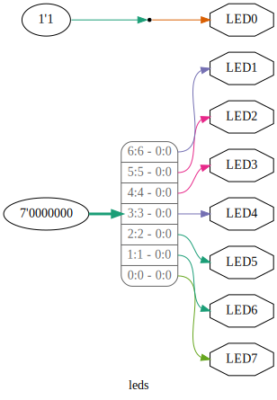

# Apio graph

The `apio graph` command generates a graphical representation of the hardware design.

## EXAMPLES

```
apio graph               # Generate an SVG file
apio graph --svg         # Generate an SVG file
apio graph --pdf         # Generate a PDF file
apio graph --png         # Generate a PNG file
apio graph -t my_module  # Graph the 'my_module' module
```

## OPTIONS

```
--svg                   Generate an SVG file (default)
--png                   Generate a PNG file
--pdf                   Generate a PDF file
-e, --env name          Use a named environment from apio.ini
-p, --project-dir path  Specify the project root directory
-t, --top-module name   Set the top-level module to graph
-v, --verbose           Show detailed output
-h, --help              Show help message and exit
```

## NOTES

- On Windows, run `explorer _build/default/hardware.svg` to view the graph.
  If your environment name is different from `default`, adjust the path accordingly.
- On macOS, use `open _build/default/hardware.svg`.

## EXAMPLE OUTPUT


