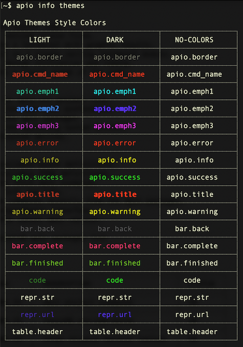

# Apio info

---

## apio info

The `apio info` command group displays additional information about Apio and your system.

<h3>Options</h3>

`  -h, --help  Show this message and exit.`

<h3>Subcommands</h3>

```
  apio info platforms
  apio info system
  apio info colors
  apio info themes
  apio info commands
```

---

## apio info platforms

The command `apio info platforms` lists the platform IDs supported by Apio and highlights your system's effective ID.

> [ADVANCED] The automatic platform ID detection of Apio can be overridden by defining a different platform ID using the `APIO_PLATFORM` environment variable, though this is generally not recommended.

<h3>Examples</h3>

```
apio info platforms   # List supported platform IDs
```

<h3>Options</h3>

```
-h, --help  Show this message and exit
```

---

## apio info system

The `apio info system` command displays general information about your system and Apio installation. Useful for diagnosing setup or environment issues.


> [NOTE] For programmatic access to this information use `apio api get-system`.


> [ADVANCED] The default location of the Apio home directory, where it saves preferences and packages, is `.apio` under your home directory. This can be changed using the `APIO_HOME` environment variable. The location of the packages directory can be set using the `APIO_PACKAGES` environment variable.

<h3>Examples</h3>

```
apio info system   # Show system information
```

<h3>Options</h3>

```
-h, --help  Show this message and exit
```

---

## apio info colors

The `apio info colors` command shows how ANSI colors are rendered on your
system, which helps diagnose color-related issues.

> The command shows colors even if the current theme is `no-colors`.

<h3>Examples</h3>

```
apio info colors          # Rich library output (default)
apio sys col -p           # Using shortcut
```

<h3>Options</h3>

```
-h, --help   Show this message and exit
```

---

## apio info themes

The command `apio info themes` shows the colors of the Apio themes. It
can be used to select the theme that works the best for you. Type
`apio preferences -h` for information on our to select a theme.

> The command shows the themes colors even if the current theme is `no-colors`.

<h3>Examples</h3>
```
apio info themes          # Show themes colors
apio inf col -p           # Using shortcuts.
```

<h3>Options</h3>
```
-h, --help  Show this message and exit.
```

<h3>Example output</h3>



## apio info commands

The command `apio info commands` lists the the available apio commands
in a table format. If the option `--docs` is specified, the command
outputs the list as a markdown document that is used to automatically
update the Apio documentation.

<h3>Examples</h3>
```
apio info commands
apio info commands --docs > docs/commands-list.md
```

<h3>Options</h3>
```
-d, --docs  Format for Apio Docs.
-h, --help  Show this message and exit.
```
