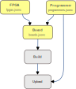

# Using Custom Boards

Apio uses definitions of FPGA devices, FPGA programmers, and
FPGA boards to simplify the setup of new projects. The diagram below
illustrates the relationship between these definitions and Apio's operation,
as well as the names of their respective definition files located in the
[Apio resources directory](https://github.com/FPGAwars/apio/tree/develop/apio/resources).

<br>



<br>

If any of these default definitions do not match the FPGA board you are using,
you can override them by placing custom definition files in the top-level
directory of your project. These replacement files should:

- Use the same file names and formats as the originals (`fpgas.jsonc`,
  `programmers.jsonc`, or `boards.jsonc`).
- Include only the specific FPGA, programmer, or board definitions you need.

## Resource Files

| Resource File       | Contains               | Keyed By        |
| :------------------ | :--------------------- | :-------------- |
| `fpgas.jsonc`       | FPGA definitions       | `fpga-id`       |
| `programmers.jsonc` | Programmer definitions | `programmer-id` |
| `boards.jsonc`      | Board definitions      | `board-id`      |

> If you believe your custom definition may be useful to others,
> consider submitting a pull request to the appropriate Apio resource file.

## Example: Custom `boards.jsonc`

The following is an example of a custom `boards.jsonc` file that defines
a variant of the `upduino31` board:

```json
{
  "upduino31c": {
    "name": "UPduino v3.1c",
    "fpga": "ice40up5k-sg48",
    "programmer": {
      "type": "iceprog"
    },
    "usb": {
      "vid": "0403",
      "pid": "6010",
      "product-regex": "UPduino v3\\.1c"
    }
  }
}
```
