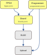

# Using Custom Boards

Apio uses definitions of FPGA devices, FPGA programmers, and
FPGA boards to simplify the setup of new projects. The diagram below
illustrates the relationship between these definitions and Apio's operation,
as well as the names of their respective definition files in the apio
`definitions` packages

<br>



<br>

If any of these default definitions do not match the FPGA board you are using,
you can override them by placing custom definition files in the top-level
directory of your project. These replacement files should:

- Use the same file names and formats as the originals (`fpgas.jsonc`,
  `programmers.jsonc`, or `boards.jsonc`).
- Include only the specific FPGA, programmer, or board definitions you need.
  You can have one or more custom definitions in each of the three files.

## Definition Files

| Definition File     | Contains               | Keyed By        |
| :------------------ | :--------------------- | :-------------- |
| `fpgas.jsonc`       | FPGA definitions       | `fpga-id`       |
| `programmers.jsonc` | Programmer definitions | `programmer-id` |
| `boards.jsonc`      | Board definitions      | `board-id`      |

> Once you added custom definitions to your project, you verify that they took
> affect using the command `apio info project` or the command
> `apio api get-project`.

<br>

> If you believe your custom definition may be useful to others,
> consider submitting a pull request to the [apio-definitions](https://github.com/FPGAwars/apio-definitions/tree/main/definitions) repository.

## Example: Custom `boards.jsonc`

The following is an example of a custom `boards.jsonc` file that defines
a variant of the `upduino31` board:

```json
{
  "upduino31c": {
    "name": "UPduino v3.1c",
    "fpga-id": "ice40up5k-sg48",
    "programmer": {
      "id": "iceprog"
    },
    "usb": {
      "vid": "0403",
      "pid": "6010",
      "product-regex": "UPduino v3\\.1c"
    }
  }
}
```

## Example: Custom `fpgas.jsonc`

The following is an example of a custom `fpgas.jsonc` file that defines
a custom fpga definition `ice40lp16k-cm121`:

```json
{
  "ice40lp16k-cm121": {
    "part-num": "ICE40LP16K-CM121",
    "arch": "ice40",
    "size": "16k",
    "ice40-params": {
      "type": "lp16k",
      "package": "cm121"
    }
  }
}
```

## Example: Custom `programmers.jsonc`

The following is an example of a custom `programmers.jsonc` file that defines
a custom programmer definition `fujprog-verbose`:

```json
{
  "fujprog-verbose": {
    "command": "fujprog",
    "args": "-l 2 --verbose"
  }
}
```

Note that the programmer command line can also be customized, within limit,
using the board's 'programmer.extra-args" field.
