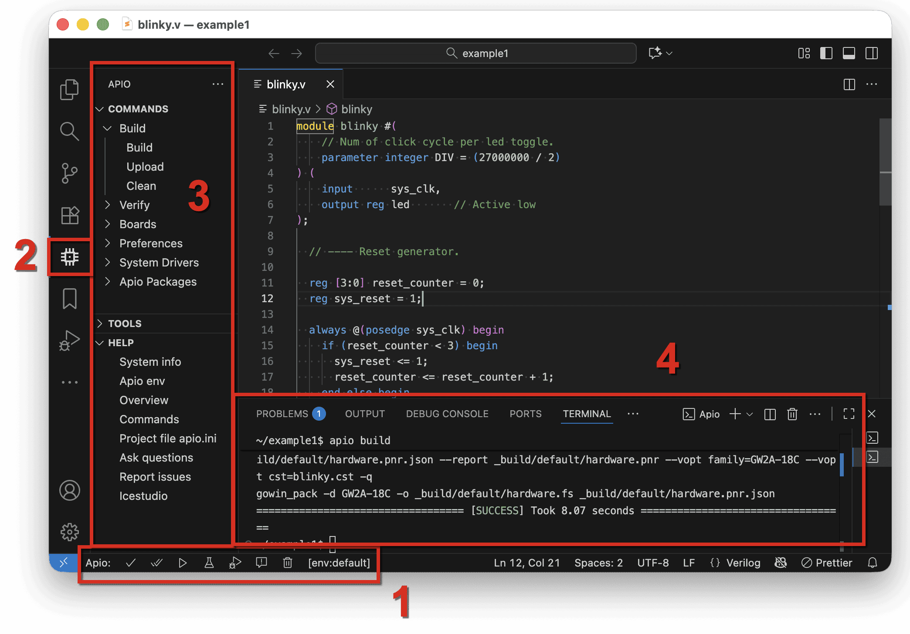

# Installing Apio IDE

To install Apio IDE, follow these steps

1. If you don't have already Visual Studio Code install, download and install it from its [official site](https://code.visualstudio.com/download)
1. Start Visual Studio Code.
1. In the Extension tab on the left, search and install the extension `fpgawars.apio1` (**Apio FPGA**).
1. This concludes the installation of the Apio IDE. The screenshot below shows the components of the Apio IDE.

> HINT: Once you start using Apio IDE, it will automatically install the Apio CLI in the `.apio/bin` directory under your home
> directory. You can add that directory to your `PATH` if you want to use the Apio CLI `apio ...` commands also outside of VS Code.

 

| Part                     | Condition                                                                                       | Function                                                                       |
| ------------------------ | ----------------------------------------------------------------------------------------------- | ------------------------------------------------------------------------------ |
| [1] Apio project buttons | Appears when an Apio project is open.                                                           | Provides quick access to common project functions.                             |
| [2] Apio extension tab   | Appears when the Apio extensions is installed.                                                  | Opens the Apio side bar with the available commands.                           |
| [3] Apio side bar        | Appears when the apio extension tab is selected.                                                | Provides access to all Apio functions.                                         |
| [4] Apio terminal        | Appears when an Apio CLI command is executed or when **TOOLS → misc → apio shell** is selected. | Shows the output of Apio CLI commands and provides the interactive Apio shell. |
