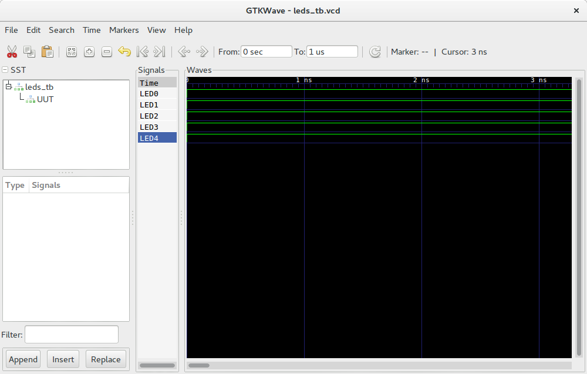

.. _cmd_sim:

apio sim
========

.. contents::

Usage
-----

.. code::

    apio sim [OPTIONS]

Description
-----------

Launch the verilog simulation using `GTKWave <http://gtkwave.sourceforge.net>`_ from a **verilog test bench**.

This command requires the ``scons`` and ``iverilog`` packages.

.. note::

  GTKWave must be installed.

  +---------+-------------------------+
  | Debian  | apt-get install gtkwave |
  +---------+-------------------------+
  | Mac OSX | brew install gtkwave    |
  +---------+-------------------------+
  | Windows | apio install gtkwave    |
  +---------+-------------------------+

Examples
--------

1. Simulate the *leds example*

.. code::

  $ apio sim
  Using default SConstruct file
  Executing: scons -Q sim -f /path/to/SConstruct
  iverilog -B /path/to/lib/ivl -o leds_tb.out -D VCD_OUTPUT=leds_tb /path/to/vlib/system.v leds.v leds_tb.v
  vvp -M /path/to/lib/ivl leds_tb.out
  VCD info: dumpfile leds_tb.vcd opened for output.
  End of simulation
  gtkwave leds_tb.vcd leds_tb.gtkw

  GTKWave Analyzer v3.3.66 (w)1999-2015 BSI

  [0] start time.
  [1000] end time.
  WM Destroy
  ================================== [SUCCESS] Took 1.96 seconds =================================
