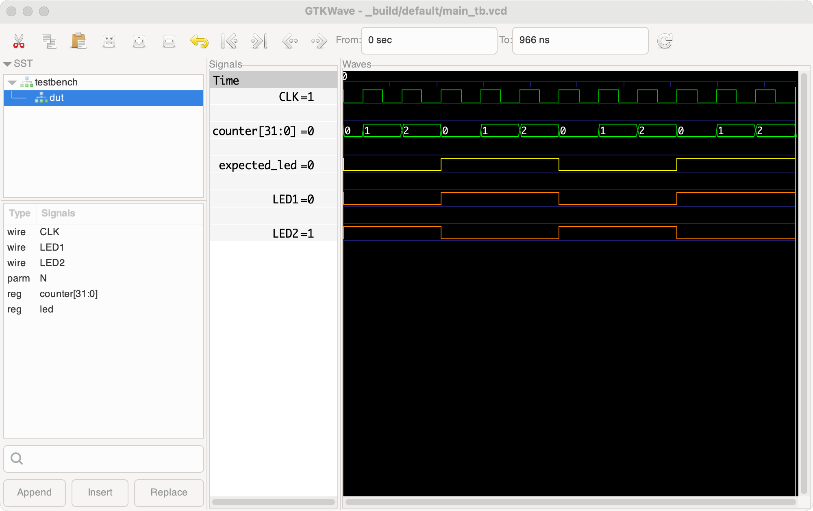

# Using testbenches

Testbenches are non-synthesizable Verilog files with the suffix `_tb.v` and SystemVerilog files with the suffix `_tb.sv` that are used to simulate and test the synthesizable modules of the project. Testbenches are used by the command `apio sim` for simulation with a graphical view of the signals, and by `apio test` for a batch test to ensure that none of the assertions in the testbenches fail.

Testbench files can be placed anywhere in the project directory tree, either near the modules they test or in a separate directory dedicated to testing. When you run `apio sim` and view the results in GTKWave, it is recommended to save the GTKWave configuration in a `.gtkw` file named after its testbench so that it will take effect the next time you run `apio sim`.

Apio defines the Verilog macro when running `apio sim` and does not define it when running `apio test`. This allows conditional calls to `$fatal` such that the simulation exits with an error when run in batch mode using `apio test`, but continues and emits the wave file when run using `apio sim`.

Make sure that your testbenches do not call `$dumpfile()` and instead let Apio set the desired location for the generated signal files. Failing to do so may result in Apio being unable to find the file when opening the GTKWave signal viewer or when cleaning the project.


## Example simulation results of a testbench

These results were generated using a testbench and the command `apio sim`.



## Instructions for AI
One way to write testbenches is to provide the tested module and instructions to an AI engine and ask it to generate the testbench code. The rules below can be copy-pasted into the AI prompt to inform it of Apio's requirements.

Apio testbench rules:

* **Rule 1**: Use `$dumpvars()` with the testbench module name as an argument.
  
* **Rule 2**: Do not use `$dumpfile()`.
  
* **Rule 3**: Compare expected values to actual values, and if they don't match, print an error message and call `$fatal` to exit.
  
* **Rule 4**: Whenever you call `$fatal` in the testbench, first check the condition `ifndef INTERACTIVE_SIM` to skip `$fatal` if the condition is false.
  
* **Rule 5**: At the end of the testbench, print the message "End of simulation".
  
* **Rule 6**: Create in the testbench a boolean signal called `tb_error` with the initial value of 0 and the comment "Set to high on first error", and set it to 1 each time an actual value does not match the expected value.

## Example

We gave this module text to ChatGPT and asked it to generate a testbench based on the rules.
```
module Main #(
    parameter integer N = 3_000_000
) (
    input  CLK,        // 12MHz clock
    output [7:0] ROWS, // LED rows
    output [3:0] COLS  // LED columns
);

  reg [31:0] counter = 0;

  reg toggle = 0;

  // Rows and columns are active low.
  assign ROWS = {6'b111111, toggle, ~toggle};
  assign COLS = 4'b1110;

  always @(posedge CLK) begin
    if (counter >= N - 1) begin
      counter <= 0;
      toggle <= !toggle;
    end else begin
      counter <= counter + 1;
    end
  end

endmodule
```

The provided testbench:

```
module Main_tb;

  reg CLK = 0;
  wire [7:0] ROWS;
  wire [3:0] COLS;

  // Clock generation: 12MHz clock -> 83.33ns period
  always #41 CLK = ~CLK;

  // Instantiate the DUT (Device Under Test)
  Main #(.N(6)) dut (
    .CLK(CLK),
    .ROWS(ROWS),
    .COLS(COLS)
  );

  // Set to high on first error
  reg tb_error = 0;

  initial begin
    $dumpvars(0, Main_tb);

    integer i;
    reg expected_toggle;

    expected_toggle = 0;

    // Wait for a few toggle events
    for (i = 0; i < 10; i = i + 1) begin
      wait (ROWS[1] != ROWS[0]);
      if (ROWS[1] !== expected_toggle || ROWS[0] !== ~expected_toggle) begin
        $display("ERROR at toggle %0d: expected ROWS[1:0] = %b%b, got %b%b",
                 i, expected_toggle, ~expected_toggle, ROWS[1], ROWS[0]);
        tb_error = 1;
`ifndef INTERACTIVE_SIM
        $fatal;
`endif
      end
      expected_toggle = ~expected_toggle;
      @(posedge CLK);
    end

    $display("End of simulation");
```
